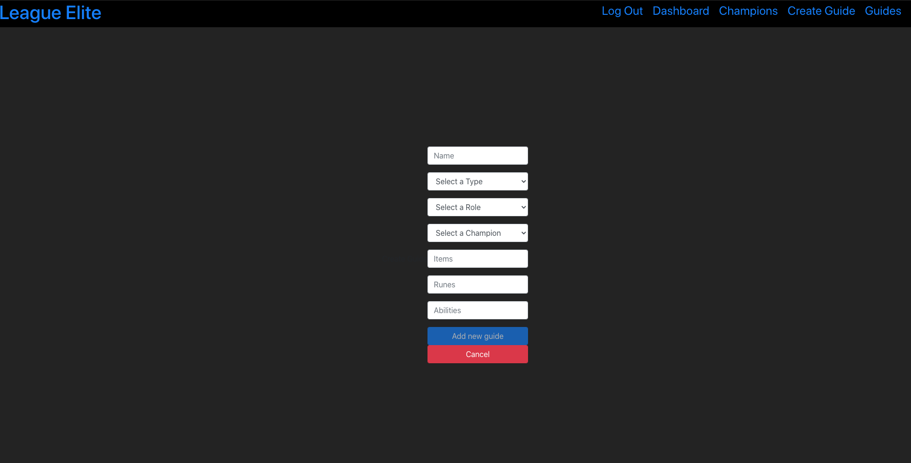

# League Elite

## Version 1.0

## Introduction

- League Elite is an application for League of Legends that allows the user to view all Champions and there Individual Data and Create and View Guides based on either Champion, Lane or General. The User is also able to Delete and Edit their own Guides.

## Screenshots

- HomePage

- Guides Page

 
- Create Guide Page

 
- Champions Page

 
- Champion Modal Page

 
## ERD

## WireFrames

- HomePage Logged In

- HomePage Logged Out

- Champions Page

## Technologies

- HTML5
- CSS3
- JavaScript
- Node.js
- Express
- MongoDB
- React
- Bootstrap
- React Bootstrap
- Styled Components
- CSS Modules
- DDragon League of Legends API
- JWT

## Getting Started

### TrelloBoard

- https://trello.com/b/diZlsC6U/project-3-league-elite

### Open Application

- https://league-elite.netlify.app/

## Unsolved Problems

-

## Future Enhancements

- Add Firebase Login for Google, Twitter, etc.
- Champion Tier Lists
- Individual Champion Lists
- Search by Player and View Player Data